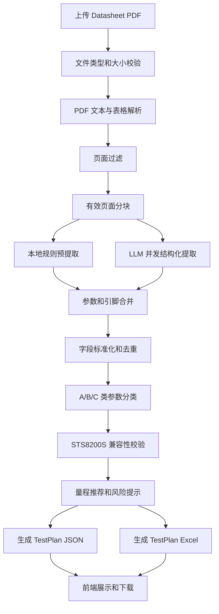
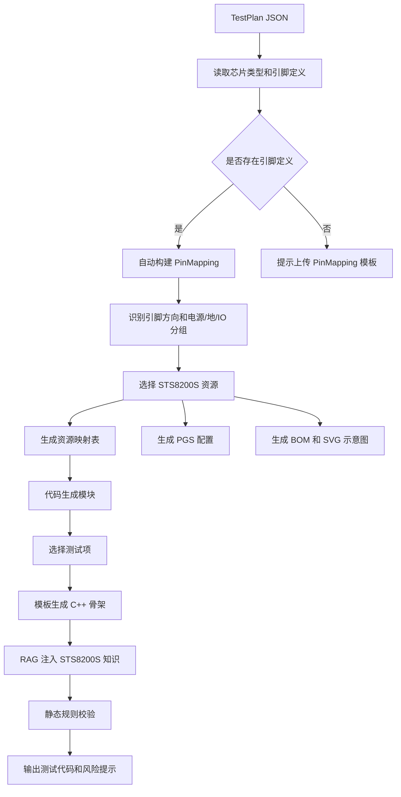
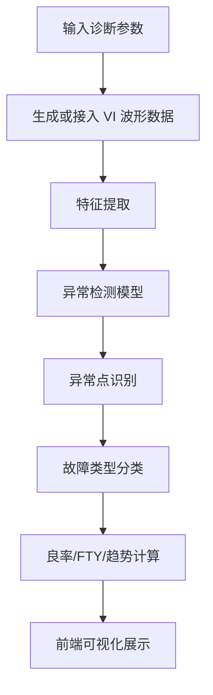

# 关键算法流程图

## Datasheet 到 TestPlan 的关键流程

## 资源映射与代码生成流程

## 良率诊断流程

## 后续可扩展点

- 将 PDF 文本解析扩展为 OCR + 视觉模型。
- 将资源映射规则扩展为完整 DUT 原理图辅助设计。
- 将良率诊断输入从仿真数据扩展为工控机实时数据。
- 将本地 LLM 调用迁移到云端任务服务，实现日志集中管理和权限控制。
