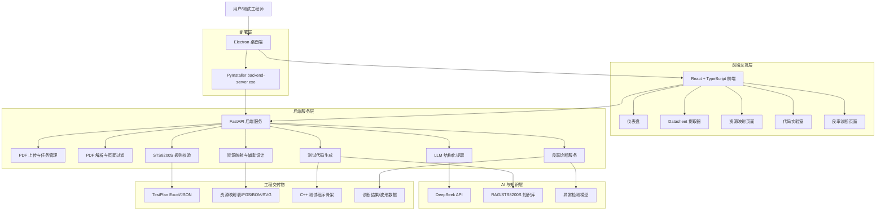

# 系统架构设计图

可将下方 Mermaid 图导出为 PNG/SVG 后放入技术报告和 PPT。

## 图示说明

- 前端负责用户交互、状态展示和文件下载。
- 后端负责 PDF 处理、模型调用、规则校验和文件生成。
- AI 层包含 DeepSeek 大模型、STS8200S 知识库和异常检测模型。
- 输出层对应比赛要求中的 TestPlan、资源映射、测试代码和诊断结果。
- 桌面端通过 Electron + PyInstaller 实现 Windows 安装运行。
