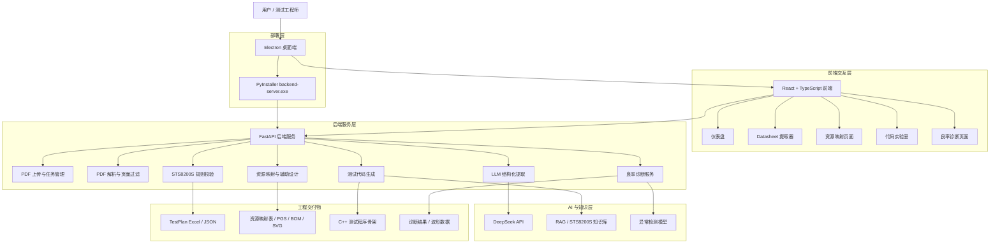

# 系统架构设计图

## 架构说明

系统采用分层设计，主要包括前端交互层、后端服务层、AI 与知识层、工程交付物输出层和桌面部署层。

| 层级 | 技术选型 | 主要职责 |
|---|---|---|
| 前端交互层 | React、TypeScript、Vite、Electron | 上传文件、展示任务状态、展示提取结果、下载工程文件 |
| 后端服务层 | FastAPI、Pydantic | PDF 解析、异步任务、模型调用、规则校验、文件生成 |
| AI 与知识层 | DeepSeek API、RAG、异常检测逻辑 | Datasheet 结构化提取、代码生成增强、诊断分析 |
| 工程交付物层 | Excel、JSON、PGS、BOM、SVG、C++ | 输出可复核、可下载、可二次编辑的工程文件 |
| 部署层 | Electron、PyInstaller、NSIS 安装包 | 桌面端安装运行、自动启动后端、健康检查和日志诊断 |

## 模块间数据流

1. 用户通过 Electron 桌面端上传 Datasheet PDF。
2. 前端调用 `/api/v1/testplan/upload` 上传文件，后端返回 `file_id`。
3. 前端调用 `/api/v1/testplan/extract-async` 创建提取任务，后端返回 `task_id`。
4. 前端轮询 `/api/v1/testplan/status/{task_id}` 获取任务进度。
5. 后端解析 PDF，过滤无效页面，调用 DeepSeek API 进行结构化提取。
6. 后端执行本地规则兜底和 STS8200S 平台校验。
7. 后端生成 TestPlan JSON 和 Excel。
8. 资源映射模块读取 TestPlan JSON，生成资源映射、PGS、BOM 和 SVG。
9. 代码生成模块通过 `/api/v1/codegen/generate` 生成 C++ 测试代码骨架。
10. 诊断模块通过 `/api/v1/diagnosis/*` 输出仿真 VI 波形和故障诊断结果。

## 路由与模块对应关系

| 前端页面 | 后端接口 | 后端实现文件 | 服务层实现 |
|---|---|---|---|
| 提取器 | `/api/v1/testplan/*` | `backend/app/api/v1/testplan.py` | `backend/app/services/testplan_service.py` |
| 资源映射 | `/api/v1/resource-map/*` | `backend/app/api/v1/resource_map.py` | `backend/app/services/resource_mapping_service.py` |
| 代码实验室 | `/api/v1/codegen/*` | `backend/app/api/v1/codegen.py` | `backend/app/services/codegen_service.py` |
| RAG 状态 | `/api/v1/rag/*` | `backend/app/api/v1/rag.py` | `backend/app/services/rag_service.py` |
| 故障诊断 | `/api/v1/diagnosis/*` | `backend/app/api/v1/diagnosis.py` | `backend/app/services/yield_diagnosis.py` |

## 部署运行机制

桌面端启动时由 `apps/electron/main.cjs` 负责后端运行时管理：

1. 在打包环境中查找 `backend-server.exe`。
2. 在开发环境中优先使用项目 `.venv` 中的 Python。
3. 自动扫描 `18080-18179` 范围内的可用端口。
4. 启动后端并轮询 `/health`。
5. 后端就绪后将 API 地址注入前端。
6. 启动失败时写入 `backend-launch.log`，便于排查其他电脑上的运行问题。
