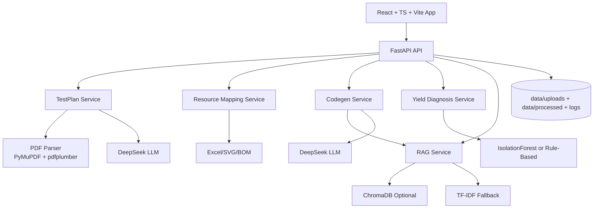
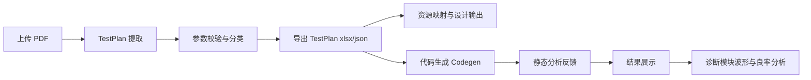

# 基于语言大模型的智能 ATE 测试开发与诊断平台——实施方案（代码对齐版）

## 1. 项目目标

本项目面向 STS8200S 测试平台，目标是构建一个可落地的 ATE 智能开发 App，覆盖以下核心链路：

1. `Datasheet/PDF -> TestPlan 参数提取`
2. `参数与引脚 -> 资源映射与辅助设计输出`
3. `测试需求 -> STS8200S C++ 测试代码生成`
4. `波形数据 -> 良率异常诊断`

当前版本以“软件可用、流程闭环”为第一优先，先实现从上传 PDF 到产出测试资产的端到端能力。

## 2. 当前代码实现范围

### 2.1 已实现模块

1. 模块 1：TestPlan 自动提取（`/api/v1/testplan/*`）
2. 模块 2：资源映射与输出（`/api/v1/resource-map/*`）
3. 模块 3：代码生成（`/api/v1/codegen/*`，含模板生成、RAG增强、静态校验）
4. 模块 4：良率诊断（`/api/v1/diagnosis/*`）
5. RAG 服务管理（`/api/v1/rag/*`）

### 2.2 当前输出资产

1. TestPlan：`xlsx`、`json`
2. 资源映射：`ResourceMap.xlsx`、`BOM.xlsx`、`Schematic.svg`
3. 代码生成：STS8200S C++ 代码文本与静态分析结果
4. 诊断结果：良率、趋势、异常事件、波形采样点

## 3. 技术路线与技术栈（按仓库代码）

### 3.1 前端栈

1. `React 19 + TypeScript`
2. `Vite 6`
3. `Tailwind CSS v4`
4. `motion`（页面动效）
5. `lucide-react`（图标）

前端通过同域路径请求后端：`/api`、`/files`、`/health`，开发期由 Vite Proxy 转发至 `localhost:8000`。

### 3.2 后端栈

1. `FastAPI + Uvicorn`
2. `Pydantic v2 + pydantic-settings`
3. `OpenAI SDK`（对接 DeepSeek 兼容接口）
4. `instructor`（结构化抽取）
5. `PyMuPDF + pdfplumber`（PDF 解析）
6. `pandas + openpyxl + numpy`（数据处理与导出）
7. `loguru`（日志）

### 3.3 AI 与算法实现

1. LLM 抽取：基于 DeepSeek API 的结构化参数提取与芯片类型识别
2. RAG：`ChromaDB` 可选，缺失时自动降级为 `TF-IDF` 检索
3. 代码生成：模板骨架 + RAG 检索增强 + LLM 润色
4. 良率诊断：`IsolationForest` 可选，缺失时降级规则诊断

### 3.4 当前不在实现内的能力（避免文档超前）

1. 未使用 `Celery/Redis` 任务队列
2. 未接入 `PostgreSQL` 等数据库（当前以文件输出为主）
3. 未引入 `LangChain` 作为 RAG 编排框架
4. 未接入真实机台在线闭环控制

## 4. 系统架构（实装态）

## 5. 端到端流程

## 6. 实施方案（后续迭代）

### 6.1 工程化优先项

1. 将 `DEBUG` 默认切换为生产安全配置
2. 收紧 CORS 白名单（替代 `*`）
3. 增加模块级测试与接口回归测试
4. 为 Codegen/RAG 增加更明确的失败降级提示

### 6.2 功能增强优先项

1. 提升 PDF 图表类内容解析效果
2. 强化模块 2 的映射规则可配置化
3. 将模块 3 的 `testprogram` 路由纳入主应用路由
4. 对接真实机台数据，减少诊断模块对仿真样本依赖

## 7. 阶段性结论

当前版本已具备“可演示、可联调、可持续迭代”的工程基础。后续工作重点应从“功能可用”转向“生产可用”，即提升安全性、稳定性、可观测性与部署规范化水平。

